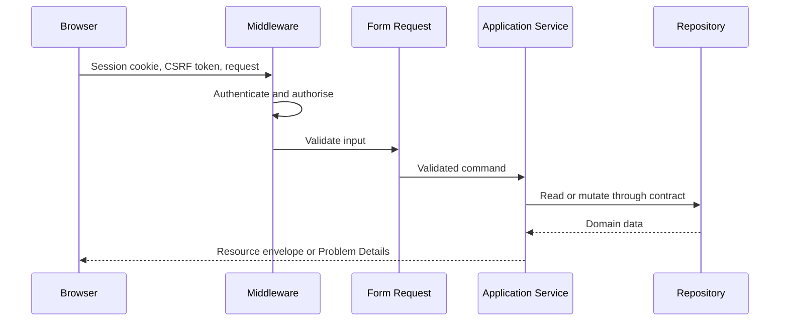

# API and Contracts

`packages/contracts/openapi.yaml` is the public API source of truth. The generated declaration at `packages/contracts/generated/api.d.ts` is consumed by the frontend.

## Conventions

- Prefix: `/api/v1`
- Media type: JSON
- Authentication: same-origin Laravel session
- Mutation protection: CSRF token
- Single resources: `{ "data": ... }`
- Collections: `{ "data": [...], "meta": ... }`
- Errors: RFC-style Problem Details with validation errors where applicable
- Concurrency: clients send `version` for protected updates

## Contract workflow

1. Edit `packages/contracts/openapi.yaml`.
2. Run `pnpm contract:lint`.
3. Run `pnpm contract:generate`.
4. Update backend behaviour and frontend usage.
5. Run `pnpm contract:check-drift`.

Generated declarations are committed so contract changes remain reviewable. Never hand-edit them.

## Compatibility

Version one endpoints remain stable. Add optional fields when possible. A breaking request, response, permission, or semantic change requires an explicit versioning decision and migration notes.
