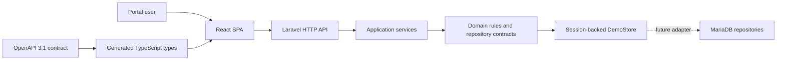

# Architecture

The portal is a contract-first monorepo. The browser depends on the OpenAPI contract, the API depends on domain interfaces, and infrastructure implements those interfaces.



## Dependency rules

- Frontend features may use shared UI, API, formatting, authentication, and site-scope utilities.
- Shared frontend modules never import feature modules.
- Controllers validate transport concerns and delegate work.
- Application services coordinate use cases and transactions.
- Domain code owns business rules and repository interfaces.
- Infrastructure implements repository interfaces and does not leak storage details upward.
- The OpenAPI document is the public interface. Generated types must never be edited manually.

## Repository map

```text
apps/web/src/app/             routing, providers, shell, and guards
apps/web/src/features/        business-facing screens and feature API hooks
apps/web/src/shared/          reusable UI and cross-feature services
apps/api/app/Http/            controllers, requests, resources, middleware
apps/api/app/Application/     use-case orchestration
apps/api/app/Domain/          rules, value objects, and contracts
apps/api/app/Infrastructure/  session-backed repository implementation
packages/contracts/           OpenAPI source, examples, generated types
```

## Runtime properties

- Authentication uses Laravel sessions and CSRF protection.
- Permissions are enforced by the API; frontend checks only improve navigation.
- Mutations use optimistic versions where concurrent edits matter.
- Inventory records are changed through ledger-producing operations.
- Demo data lives in session state, so it is isolated per browser session.
- The React production build and Laravel front controller share the cPanel document root.

For a storage change, implement the existing repository contracts and bind the new adapters in the service provider. Controllers and frontend endpoints should not change.
