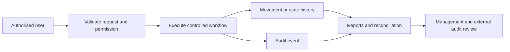

# Audit Readiness

The portal should let an external auditor reconstruct who did what, when, where, why, and with whose approval.

## Evidence already supported

- Immutable inventory movements with actor and timestamp
- Controlled reasons for receipts, issues, adjustments, reversals, and counts
- Transfer state history and receiving discrepancies
- Stock-count review and posting workflow
- Asset assignment, status, and meter history
- Role and site-scoped permissions
- User and profile change events with sensitive values redacted
- Searchable operational and audit reports

## Control model

## Production controls still required

- Confirm legal entities, sites, warehouses, and stock ownership.
- Define approval thresholds and segregation of duties.
- Agree units, valuation, cut-off, period close, and opening balances.
- Configure retention, backups, restore testing, and access reviews.
- Record evidence attachments where source documents are required.
- Define auditor export formats and sampling procedures.
- Reconcile the portal with finance, procurement, and client-owned stock records.

## Auditor pack

A period pack should include:

- User, role, and site-access listing
- Opening and closing stock by site
- Full movement ledger
- Adjustment and reversal report
- Transfer exceptions and aged in-transit stock
- Count variances, recounts, approvals, and postings
- Asset register and status changes
- Audit-event export
- Evidence of backup, restore, and access reviews

The website and demo fixtures are not proof of operational compliance. Final controls must be agreed with Phatsema management and their external auditors before production use.
