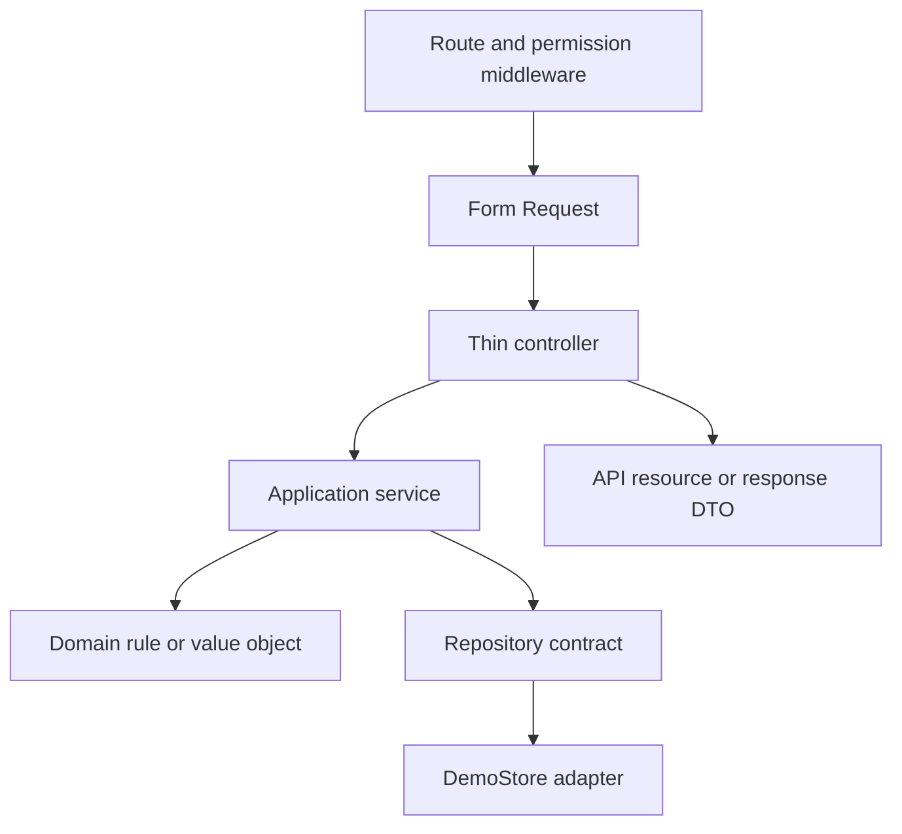

# Backend

The Laravel API follows a layered design so demo storage can be replaced without rewriting business workflows.

## Responsibilities

| Layer | Owns | Must not own |
|---|---|---|
| HTTP | Routing, authentication, validation, response shape | Inventory rules |
| Application | Use-case coordination, units of work, audit emission | Session implementation |
| Domain | Invariants, state transitions, quantities, interfaces | Laravel responses |
| Infrastructure | Persistence and repository implementation | Public API policy |

## Security and integrity

- Routes are authenticated unless explicitly public.
- Permission middleware and policies deny unauthorised actions.
- Form Requests reject unrecognised or invalid inputs.
- Application services recheck operational rules.
- Audit events contain identifiers and changed field names, not secrets or sensitive profile contents.
- Passwords are hashed and never returned.
- Quantity changes pass through the inventory ledger and unit of work.
- Transfer and count transitions reject invalid state changes.

## Adding a use case

1. Confirm or update the OpenAPI contract.
2. Add domain behaviour or a repository method when required.
3. Implement orchestration in an application service.
4. Add a focused Form Request and response mapping.
5. Keep the controller limited to delegation.
6. Add permission, audit, unit, and feature coverage.

The `DemoStore` implements several small repository interfaces. Do not introduce a new controller dependency on the concrete store.
