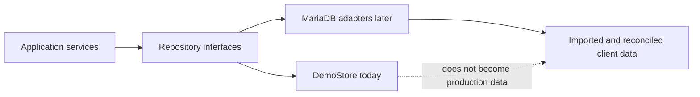

# Demo Data

The demonstration uses a versioned fixture factory and session-backed repository implementation. It behaves like an application database while remaining resettable and safe for demonstrations.

## Current model

- Fixture version: `1.4.0`
- Storage: Laravel session
- Reset: administrator-only endpoint
- Isolation: each browser session receives its own working data
- Identifiers: generated by the sequence repository
- Persistence: survives requests in the session but is not a permanent system of record

Validate fixtures with:

```bash
pnpm fixtures:validate
```

## Data ownership

Keep these concepts separate:

- Stock for sale
- Site consumables
- Spare parts
- Fabricated-to-order goods
- Company-owned assets
- Hired assets
- Client-owned equipment
- Stock in transit

## Future MariaDB path



The database implementation must preserve domain invariants, optimistic versions, immutable movement history, audit events, permissions, and existing API shapes. Production migration also requires agreed site codes, units, opening balances, ownership, serial numbers, and reconciliation sign-off.
