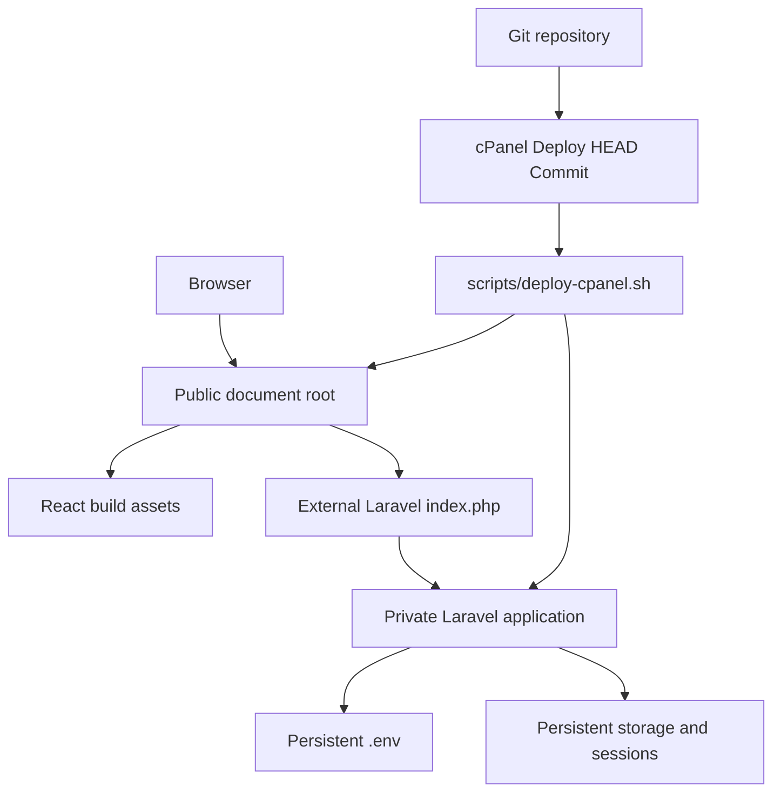

# cPanel Deployment

Production URL: [phatsema.valosystems.co.za](https://phatsema.valosystems.co.za)

## Topology



## Fixed paths

```text
Public:  /home/valosyst/public_html/phatsema.valosystems.co.za
Private: /home/valosyst/apps/phatsema-api
PHP:     /opt/alt/php85/usr/bin/php
```

The public root contains the React build, `.htaccess`, and external Laravel front controller. Application code and dependencies remain outside `public_html`.

## Build and verify

```bash
pnpm release
bash scripts/deploy-cpanel.sh --check
```

The release command runs all quality gates, builds the frontend, installs production Composer dependencies, creates per-file checksums, and writes:

```text
release/phatsema-portal-1.0.0.tar.gz
release/phatsema-portal-1.0.0.tar.gz.sha256
```

## Deploy

1. Commit the verified archive and checksum with the source revision.
2. In cPanel Git Version Control, update from the remote.
3. Select **Deploy HEAD Commit**.
4. The deployment script validates the checksum before changing live files.
5. It preserves `.env`, application storage, `.well-known`, and the live `.htaccess`.
6. It runs Laravel optimisation when the production `.env` exists.

## Smoke test

- `/api/v1/health` returns success.
- Login and `/api/v1/auth/me` succeed without a 500 response.
- Dashboard and one nested SPA route refresh directly.
- One read and one permitted mutation succeed.
- The mutation appears in the audit log.
- Logout invalidates the session.

Rollback by deploying a previously verified commit and its matching archive. Never copy the private application into the public document root.
