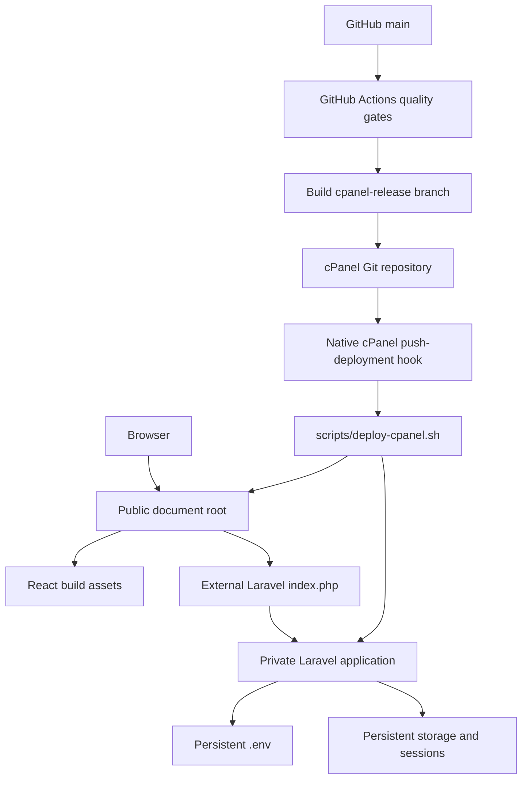

# cPanel Deployment

Production URL: [phatsema.valosystems.co.za](https://phatsema.valosystems.co.za)

## Topology



## Fixed paths

```text
Public:  /home/valosyst/public_html/phatsema.valosystems.co.za
Private: /home/valosyst/apps/phatsema-api
PHP:     /opt/alt/php85/usr/bin/php
```

The public root contains the React build, `.htaccess`, and external Laravel front controller. Application code and dependencies remain outside `public_html`.

## Build and verify

```bash
pnpm release
bash scripts/deploy-cpanel.sh --check
```

The release command runs all quality gates, builds the frontend, installs production Composer dependencies, creates per-file checksums, and writes:

```text
release/phatsema-portal-1.0.0.tar.gz
release/phatsema-portal-1.0.0.tar.gz.sha256
```

`pnpm release:package` is reserved for CI after all quality jobs pass. It packages the already-tested revision without rerunning the complete suite.

## Automated deployment

Every push to `main` starts the continuous-integration workflow. Production deployment runs only after the frontend, backend, browser, documentation, contract, and bundle-integrity jobs pass.

The production job:

1. Merges the tested `main` revision into the `cpanel-release` branch.
2. Rebuilds the frontend and creates a release bundle linked to the tested source SHA.
3. Commits the archive and checksum to `cpanel-release`.
4. Pushes that commit to the cPanel-managed repository over a dedicated SSH key.
5. Lets cPanel run `.cpanel.yml` and `scripts/deploy-cpanel.sh`.
6. Verifies the public application and anonymous authentication response.

The deployment script validates checksums before changing live files. It preserves `.env`, application storage, `.well-known`, and the live `.htaccess`, then runs Laravel optimisation when the production `.env` exists.

The GitHub `production` environment stores the SSH private key and pinned host keys. Repository code contains only non-sensitive connection settings. Rotate the key in both GitHub and cPanel if it is ever exposed.

The cPanel interface is retained for deployment history and emergency operations, but normal releases do not require **Update from Remote** or **Deploy HEAD Commit**.

## Smoke test

- `/api/v1/health` returns success.
- Login and `/api/v1/auth/me` succeed without a 500 response.
- Dashboard and one nested SPA route refresh directly.
- One read and one permitted mutation succeed.
- The mutation appears in the audit log.
- Logout invalidates the session.

Rollback by deploying a previously verified commit and its matching archive. Never copy the private application into the public document root.

For an automated rollback, reset `cpanel-release` to the required verified deployment commit through a reviewed workflow change, then push that commit to cPanel. Do not rewrite `main`.
