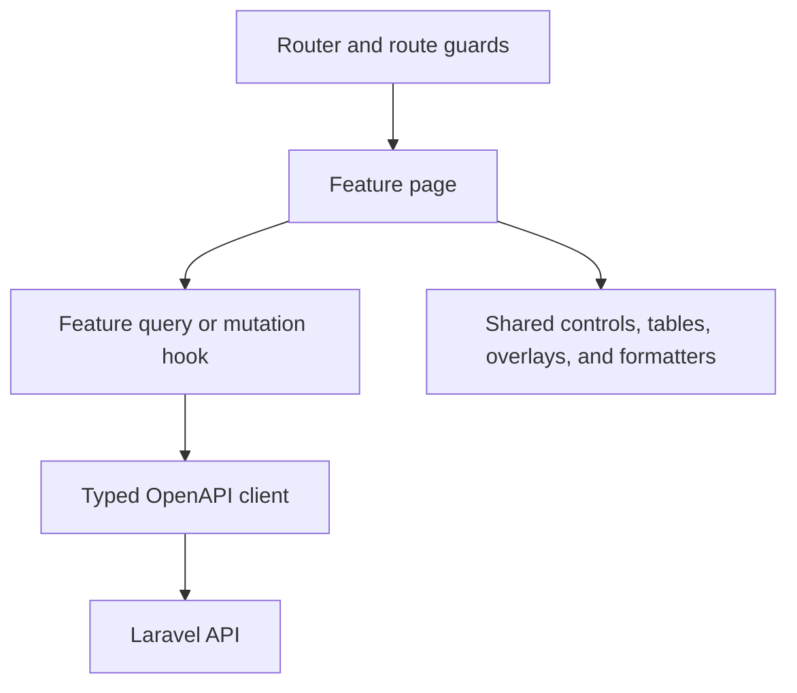

# Frontend

The frontend is a strict TypeScript React application. It favours feature folders, reusable primitives, explicit server-state hooks, and accessible Ark UI components.

## Where code belongs

| Change | Location |
|---|---|
| Route, provider, shell, or navigation | `src/app` |
| Page or workflow unique to one module | `src/features/<module>` |
| Reusable visual primitive | `src/shared/ui` |
| API client behaviour | `src/shared/api` |
| Authentication or permission helpers | `src/shared/auth` |
| Date, quantity, or display formatting | `src/shared/format` |

## Standards

- Use `TextField`, `TextArea`, `Select`, `NumberField`, `DatePicker`, and other exported controls. Native interactive elements are restricted by ESLint.
- Use TanStack Query for server state and invalidate the smallest stable query-key family after mutations.
- Derive request and response shapes from `@phatsema/contracts/api`.
- Keep pages focused on composition. Extract repeated display or interaction patterns into shared modules.
- Lazy-load route pages and preserve the existing error boundary.
- Respect site scope and permissions without treating frontend checks as security.
- Use design tokens from `src/styles/app.css`; do not introduce arbitrary colours.
- Tables use the shared `DataTable`, toolbar, density, column, summary, empty-state, and pagination patterns.

## Forms

- Use React Hook Form and Zod where schema-driven validation improves clarity.
- Display field errors and a useful submission summary.
- Keep server validation authoritative.
- Do not ask users to invent system identifiers when the API can generate them.
- Preserve optimistic versions and provide conflict recovery.

## Testing

Place focused tests beside the module or shared component. Test observable behaviour, permission boundaries, validation, formatting, and error handling. Use Playwright for complete workflows and responsive behaviour.
