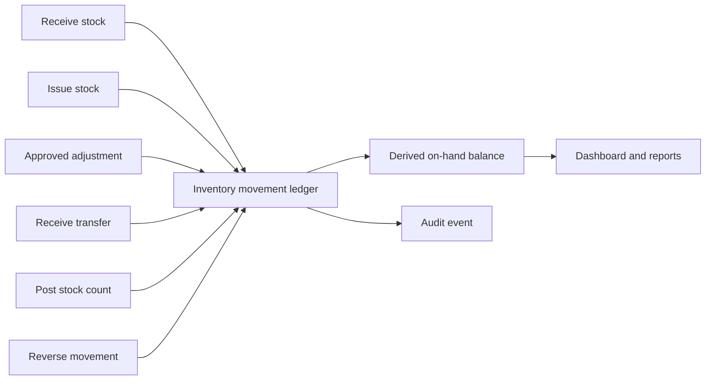
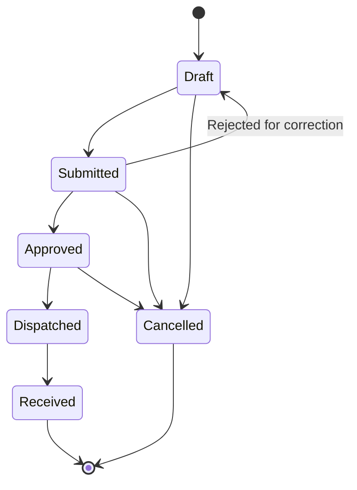
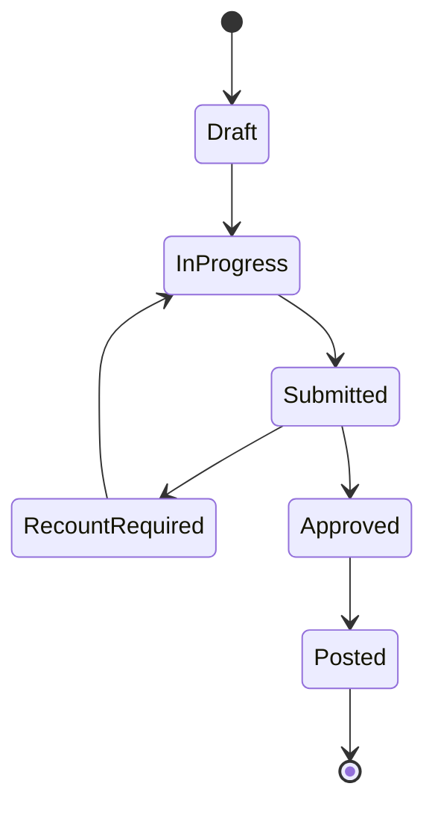

# Inventory Workflows

Inventory is trustworthy when every quantity change has a reason, actor, time, site, location, item, and audit trail.

## Direct stock actions

- A receipt increases stock at one site and location.
- An issue decreases available stock and records its recipient or purpose.
- An adjustment corrects a known variance with a controlled reason.
- A reversal creates compensating history rather than deleting the original movement.
- Negative stock and invalid units are rejected.

## Transfers

Dispatch moves responsibility into transit. Receipt posts the destination quantities and records discrepancies. Users cannot skip required states.

## Stock counts

Posting creates the approved correcting movements. A count does not silently overwrite balances.

## Assets

Assets are serialised operational records, not stock quantities. Assignment, status, site, location, meter readings, maintenance state, and ownership must remain distinct from consumable inventory.
